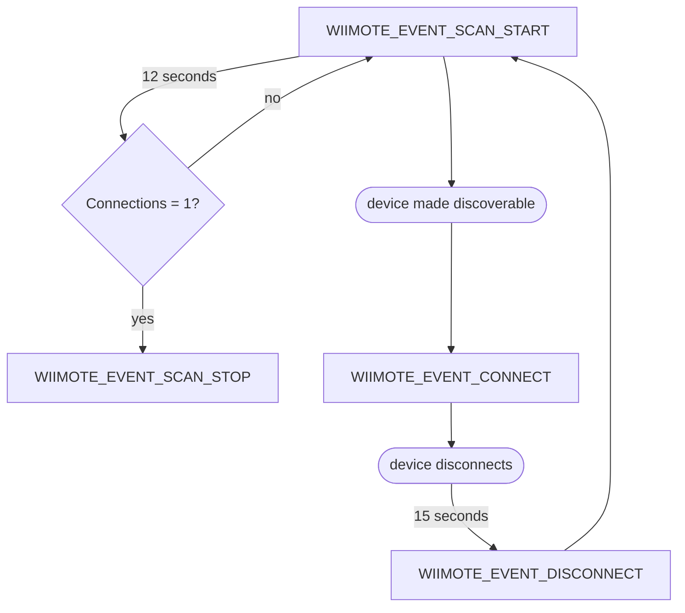

# Wiimote Bluetooth Connection Library for Arduino core for ESP32

## Notes

1. Pairing is only stored on the wiimote when using the red-sync button, pairing by pressing 1 & 2 is not saved.
2. Reconnecting a paired device is easier when scanning is off.

## Connection Flow

## See Also

- https://wiibrew.org/wiki/Wiimote
  - https://wiibrew.org/wiki/Wiimote/Extension_Controllers
  - https://wiibrew.org/wiki/Wii_Balance_Board
- http://www.yts.rdy.jp/pic/GB002/GB002.html
  - http://www.yts.rdy.jp/pic/GB002/hcip.html
  - http://www.yts.rdy.jp/pic/GB002/hcic.html
  - http://www.yts.rdy.jp/pic/GB002/l2cap.html
- https://qiita.com/jp-96/items/ff3822ab81f7696172c0
- https://www.wdic.org/w/WDIC/Bluetooth
  - https://www.wdic.org/w/WDIC/HCI%20%28Bluetooth%29
  - https://www.wdic.org/w/WDIC/L2CAP
